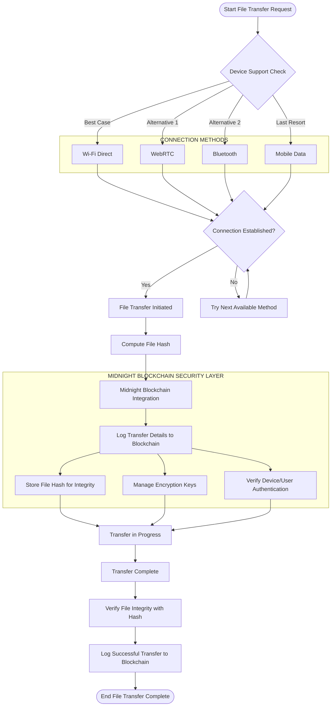

# Unishare


## Seamless Cross-Platform File Sharing

Unishare is a powerful Tauri application built with Rust that enables seamless offline file sharing between macOS and Windows devices. It bridges the gap between Apple's AirDrop and Windows' Nearby Share with a universal solution that works across platforms, without requiring devices to be on the same Wi-Fi network.

## ✨ Features

- **🖥️ Cross-Platform**: Share files between macOS and Windows seamlessly
- **🔌 Works Offline**: Transfer files without an internet connection
- **🌐 Multiple Connection Methods**: Automatically selects the optimal connection method
- **🔒 Security-Focused**: Optional Midnight blockchain integration for enhanced security and data integrity
- **🎯 User-Friendly**: Simple drag-and-drop interface
- **⚡ Fast Transfers**: Optimized for speed with direct device-to-device connections

## 🔄 How It Works

Unishare intelligently selects the best available connection method in this priority order:

1. **Wi-Fi Direct** - For nearby devices, even without internet (Best Case)
2. **WebRTC** - When both devices have internet access (Alternative 1)
3. **Bluetooth** - For close-range sharing when Wi-Fi isn't available (Alternative 2)
4. **Mobile Data** - As a fallback option when other methods fail (Last Resort)

### File Transfer Process Flow



## 🚀 Installation

### macOS
```
brew install unishare
```

### Windows
```
winget install unishare
```

<!-- Or download the installer directly from our [releases page](https://github.com/unishare/releases). -->


## 📝 Usage

1. Launch Unishare on both devices
2. Select files you want to share
3. Choose the recipient device from the discovered devices list
4. Confirm the transfer on the receiving device
5. Files are transferred directly between devices

## 🔐 Advanced Security with Midnight Blockchain

Unishare offers optional integration with the Midnight blockchain for enhanced security:

- **Data Integrity & Logging**: Tamper-proof records of file transfers with blockchain verification
- **Decentralized Authentication**: Secure device verification before transfers
- **Secure Key Management**: Additional layer of encryption security

<!-- To enable Midnight integration:

1. Go to Settings > Security
2. Enable "Blockchain Security"
3. Follow the setup instructions -->

## 💻 Development

Unishare is built with:
- [Tauri](https://tauri.app/) - For the application framework
- [Rust](https://www.rust-lang.org/) - For performance-critical backend operations
- [TypeScript](https://www.typescriptlang.org/) - For the frontend interface

### Building from Source

```bash
# Clone the repository
git clone https://github.com/unishare/unishare.git
cd unishare

cd unishare

# Install dependencies
npm install

cd src-tauri
# Run in development mode
npm run tauri dev

# Build for production
npm run tauri build
```


## For Proper Development Preview

```bash
git clone https://github.com/unishare/unishare.git

cd unishare

cd unishare-frontend

npm install

npm run tauri dev

```

## 🔍 Technical Architecture

Unishare follows a sophisticated connection flow as visualized in the diagram below:

1. **Transfer Request**: User initiates file transfer
2. **Device Support Check**: System checks available connection methods
3. **Connection Attempt**: Tries each method in priority order until successful
4. **File Security**: Computes file hash and integrates with Midnight blockchain
5. **Transfer Verification**: Ensures file integrity before completing the transfer

The blockchain integration provides three key security features:
- File hash storage for integrity verification
- Secure encryption key management
- Device and user authentication

## 👥 Contributing

We welcome contributions! Please see our [CONTRIBUTING.md](CONTRIBUTING.md) for guidelines on how to participate in the development of Unishare.

## 📄 License

MIT License - See [LICENSE](LICENSE) for details.

## 🔏 Privacy Policy

Unishare is designed with privacy in mind:
- No data is stored on servers
- File transfers are direct between devices
- Optional blockchain integration only stores cryptographic hashes, not file contents

## 🆘 Support

- [Documentation](https://docs.unishare.app)
- [GitHub Issues](https://github.com/unishare/issues)
- [Discord Community](https://discord.gg/unishare)